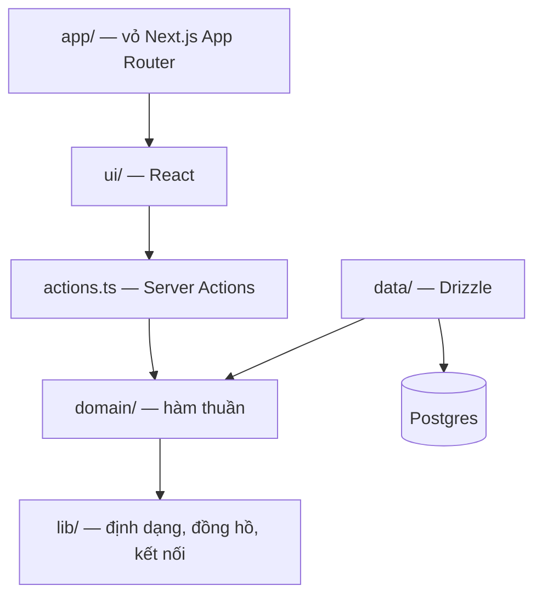
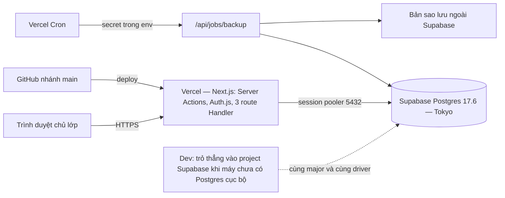

# Architecture Spine — Haninn English Class

## Design Paradigm

**Modular monolith theo feature, lõi domain thuần.** Mỗi capability là một module. Trong module có bốn phần với luật phụ thuộc một chiều; App Router của Next.js chỉ là lớp vỏ mỏng — page render `ui/`, form gọi `actions.ts`, và cả hai đều không chứa luật nghiệp vụ.



Hướng phụ thuộc là luật, không phải gợi ý: `ui → actions → domain`, `data → domain`, và `domain` không phụ thuộc vào ai. Đường dẫn đầy đủ của một module là `src/modules/<miền>/…`. `lib/` chỉ chứa hạ tầng dùng chung — không phải chỗ lách để giấu luật nghiệp vụ.

## Invariants & Rules

### AD-1 — Kiến trúc module theo feature với lõi domain thuần

- **Binds:** all
- **Prevents:** luật nghiệp vụ (tiền, lịch) rải vào React component và Server Action, không test được và mỗi màn tính một kiểu; và luật bị giấu vào `lib/` để né luật module
- **Rule:** mỗi miền là `src/modules/<miền>/` gồm `public.ts`, `domain/`, `data/`, `ui/`, `actions.ts`. `domain/` chỉ chứa hàm thuần, cấm import React, Next.js, Drizzle và mọi thứ gây I/O. Hướng phụ thuộc `ui → actions → domain`, `data → domain`, `domain → ∅` không có ngoại lệ. `lib/` chỉ được chứa bốn thứ: định dạng, đồng hồ nghiệp vụ, xác thực, kết nối cơ sở dữ liệu — cấm đặt bất kỳ hàm nào đọc ghi dữ liệu nghiệp vụ ở đó.

### AD-2 — Mặt tiếp xúc công khai của module

- **Binds:** all
- **Prevents:** hai module cùng truy vấn một bảng theo hai luật khác nhau; và việc lách qua `public.ts` bằng cách tái xuất bảng, schema hay kiểu Drizzle để module khác tự viết truy vấn
- **Rule:** module khác chỉ được import `<module>/public.ts`. Cấm import `domain/`, `data/`, `ui/` và `actions.ts` xuyên module. `public.ts` chỉ được xuất ba loại: kiểu dữ liệu thuần, hàm thuần, và hàm nghiệp vụ đọc nhận sẵn kết nối cơ sở dữ liệu. Cấm tái xuất đối tượng bảng, schema Drizzle và kiểu suy ra từ Drizzle. Bảng do module sở hữu tự khai trong `data/schema.ts` của nó, và mọi câu truy vấn trên bảng đó nằm trong chính module ấy.

### AD-3 — Buổi học suy ra từ lịch có hiệu lực theo ngày [ADOPTED]

- **Binds:** CAP-1, CAP-3, CAP-4, CAP-7
- **Prevents:** hai nguồn sự thật cho câu "hôm nay có buổi nào"; việc sửa lịch viết lại quá khứ; bản ghi điểm danh mồ côi bị module này đếm còn module kia lọc bỏ; và ghi điểm danh cho một buổi không tồn tại
- **Rule:** chỉ lưu quy tắc lịch của lớp (thứ trong tuần + giờ bắt đầu) và bản ghi điểm danh; không có bảng buổi. Quy tắc lịch có hiệu lực theo ngày: sửa lịch là thêm một mốc `effectiveFrom` mới, cấm sửa hoặc xoá mốc đã có. `classes/public.ts` xuất đúng một hàm sinh buổi `sessionsBetween(classId, from, to)`; mọi module khác lấy buổi từ đó, cấm tự suy. Khoá buổi là bộ ba `classId`, `date`, `startTime`. Ghi điểm danh **bắt buộc** kiểm buổi đó có trong `sessionsBetween` — buổi không tồn tại thì bị từ chối, nên buổi bù và ngày nghỉ lễ phải chờ bảng ngoại lệ ở mục Deferred. Khi đọc, bản ghi điểm danh không còn khớp buổi nào theo lịch hiện tại vẫn được **tính vào** tổng (hợp, không lọc) — đổi lịch không được làm biến mất dữ liệu đã ghi.

### AD-4 — Tiền là số nguyên VND, và chỉ có một phép làm tròn được phép

- **Binds:** CAP-2, CAP-5, CAP-7, CAP-8
- **Prevents:** sai số dấu phẩy động trong tổng thu và công nợ; hai cách làm tròn cho ra hai con số khác nhau; và một luật "cấm mọi làm tròn" bất khả thi khi giao diện phải hiện phần trăm
- **Rule:** mọi trường tiền là số nguyên, đơn vị đồng. Cấm kiểu số thực và kiểu decimal cho tiền. Chỉ đúng hai phép làm tròn được phép tồn tại: phép chia học phí theo buổi ở AD-5, và phép làm tròn để **hiển thị** phần trăm — phần trăm luôn tính từ hai số nguyên bằng số nguyên rồi mới làm tròn ở `lib/format`, và không bao giờ được lưu. Mọi phép làm tròn khác đều bị cấm.

### AD-5 — Giá hiệu lực theo ngày, chia theo buổi cho tháng lệch [ADOPTED]

- **Binds:** CAP-2, CAP-5, CAP-8
- **Prevents:** sửa học phí hôm nay làm đổi số công nợ của các tháng đã qua; học sinh biến mất khỏi danh sách nợ vì thiếu mốc giá; hai cách chia tiền cho tháng vào giữa tháng; và mỗi nơi chia một kiểu
- **Rule:** đơn giá và miễn giảm lưu thành các mốc hiệu lực theo ngày cho từng học sinh; ghi mốc mới là thêm dòng, cấm sửa hoặc xoá mốc đã có. Số phải thu của kỳ M là hàm thuần, và **mọi kỳ phải tra ra được một mốc** — không tra được thì giao diện hiện trạng thái lỗi rõ ràng, tuyệt đối không được trả về 0 hay bỏ học sinh khỏi danh sách. Học sinh có mặt suốt tháng thì số phải thu bằng đơn giá trừ miễn giảm. Tháng lệch — học sinh bắt đầu sau buổi đầu tiên của lớp trong tháng, hoặc nghỉ trước buổi cuối cùng của lớp trong tháng — thì số phải thu bằng đơn giá trừ miễn giảm, nhân với số buổi lớp đã diễn ra từ ngày bắt đầu (hoặc tới ngày nghỉ) đến hết tháng, chia cho tổng số buổi của lớp trong tháng đó; làm tròn nửa lên tới đồng và tính hoàn toàn bằng số nguyên. Tử số đếm **buổi lớp đã diễn ra, không đếm buổi học sinh có mặt** — điểm danh không bao giờ ảnh hưởng tới tiền. Mẫu số lấy từ chính `sessionsBetween` của AD-3, không khai tay. Không có bảng hoá đơn.

### AD-6 — Sổ thu là nguồn duy nhất của "đã thu" [ADOPTED]

- **Binds:** CAP-5, CAP-7, CAP-8
- **Prevents:** hai cách trả lời "đã đóng chưa"; và việc sửa hoặc xoá một khoản thu làm lịch sử tiền đổi âm thầm
- **Rule:** mỗi lần thu là một bản ghi payment gồm học sinh, kỳ, số tiền, ngày thu và lớp của học sinh tại thời điểm thu. Công nợ của kỳ bằng số phải thu trừ tổng payment của kỳ đó; thu một phần được phép. Sổ thu là **chỉ ghi thêm**: cấm xoá bản ghi payment và cấm sửa số tiền; ghi nhầm thì sửa bằng một bản ghi điều chỉnh mới. Không tồn tại cờ "đã thu" ở bất kỳ bảng nào.

### AD-7 — Không lưu và không cache số dẫn xuất

- **Binds:** CAP-1, CAP-5, CAP-7, CAP-8
- **Prevents:** cột hoặc bảng tổng hợp lệch khỏi dữ liệu gốc; và việc lách luật bằng một lớp cache chạy trong tiến trình thay vì bằng một cột
- **Rule:** công nợ, thu nhập, số buổi và tỉ lệ điểm danh đều được tính bằng hàm thuần từ dữ liệu gốc ở mỗi lần đọc. Cấm cột cache, cấm bảng tổng hợp, cấm mọi lớp cache kết quả tính toán trong tiến trình. Cột `period` trên payment là **dữ liệu đầu vào do người dùng chọn, không phải số dẫn xuất**, nên được phép tồn tại. Muốn tối ưu sau này thì phải có AD mới thay thế AD này.

### AD-8 — Thu nhập là tiền thực nhận, theo ngày thu [ADOPTED]

- **Binds:** CAP-1, CAP-5, CAP-7
- **Prevents:** màn Tổng quan và màn Báo cáo trả lời "thu nhập tháng" theo hai định nghĩa khác nhau; và việc trả nhầm tiền của tháng này cho tháng khác
- **Rule:** "Thu nhập" ở mọi màn hình và trong file Excel bằng tổng số tiền của các payment có **ngày thu** nằm trong khoảng đang xét. Kỳ của payment chỉ dùng để tính công nợ, không dùng để tính thu nhập — một khoản thu ngày 03/10 cho kỳ 9 là thu nhập tháng 10 và làm giảm công nợ tháng 9. Số phải thu và công nợ là chỉ số riêng, hiển thị riêng, không được gọi là thu nhập. Hàm sở hữu chỉ số này là `payments/public.incomeBetween`, theo AD-12. Ghi chú: điều này thay cách diễn đạt trước đó của spec (nghiệm thu theo số phải thu); spec đã được cập nhật cho khớp.

### AD-9 — Kỳ thu là dữ liệu đầu vào, và hạn đóng là luật lặp theo học sinh [ADOPTED]

- **Binds:** CAP-2, CAP-5, CAP-7, CAP-8
- **Prevents:** mỗi màn định nghĩa "kỳ" một kiểu; việc suy kỳ từ ngày thu khiến đóng muộn bị tính sai; hạn đóng bị lưu lặp trên từng kỳ rồi lệch nhau; và nút "đánh dấu đã thu" ghi một ngày khác với form ghi thu
- **Rule:** kỳ thu là cặp `studentId` và `period` dạng YYYY-MM theo múi giờ Asia/Ho_Chi_Minh. Mỗi payment mang `period` do người ghi chọn — đây là dữ liệu đầu vào, không suy từ ngày thu; đóng muộn hợp lệ. Hạn đóng là thuộc tính của học sinh, lưu thành mốc hiệu lực theo ngày giống AD-5, áp cho mọi kỳ cho tới khi đổi, và **không** lưu trên từng kỳ. Nút "đánh dấu đã thu" ghi đúng số còn thiếu, với `period` là kỳ đang xem và ngày thu là `businessToday()` của AD-13 — không được chọn ngày khác. Danh sách nợ hiển thị theo từng kỳ, không cộng dồn nhiều tháng.

### AD-10 — Một tài khoản, một cửa kiểm phiên, và các ngoại lệ có tên [ADOPTED]

- **Binds:** all
- **Prevents:** hai cơ chế xác thực song song; một route quên kiểm phiên; middleware chạm cơ sở dữ liệu trong khi chạy ở Edge; và việc bắt cả `/api/auth/*` phải có phiên — chính route dùng để lấy phiên
- **Rule:** Auth.js với credentials và bảng user là cơ chế xác thực duy nhất, dùng chiến lược phiên JWT — bảng user **không** phải nơi lưu phiên. Cửa kiểm phiên duy nhất là `requireUser()` trong `lib/auth`, được gọi ở đầu mọi Server Action. Middleware chỉ làm một việc: chuyển người chưa đăng nhập về `/login`; nó phải an toàn với Edge nên cấm chạm cơ sở dữ liệu, và cấu hình xác thực phải tách phần dùng được ở Edge. Ngoại lệ được kể tên đúng ba chỗ: `/api/auth/*`, trang `/login`, và route job sao lưu ở AD-15. Không có vai trò và không có kiểm tra phân quyền ở bất kỳ tầng nào. Chủ lớp đổi được mật khẩu trong ứng dụng tại `/account`.

### AD-11 — Ghi dữ liệu qua Server Actions, với đúng ba ngoại lệ

- **Binds:** all
- **Prevents:** hai đường ghi với hai bộ kiểm tra dữ liệu khác nhau; và một câu "ngoại lệ duy nhất" bị mâu thuẫn ngay bởi chính hệ thống xác thực
- **Rule:** mọi thay đổi dữ liệu đi qua Server Action; đầu vào được kiểm bằng schema ở biên; luật nghiệp vụ nằm trong `domain/`. Ba ngoại lệ, và chỉ ba: `/api/auth/*` do Auth.js sở hữu, Route Handler GET để tải file Excel, và route job sao lưu ở AD-15. Không thêm ngoại lệ thứ tư mà không có AD mới.

### AD-12 — Mỗi chỉ số có đúng một hàm sở hữu

- **Binds:** CAP-1, CAP-5, CAP-7, CAP-8
- **Prevents:** màn Tổng quan và màn Báo cáo cài hai lần cùng một con số rồi lệch nhau; file Excel tự tính lại; và việc "đúng một hàm" bị hiểu là chỉ trong phạm vi một capability
- **Rule:** mỗi chỉ số — thu nhập, số phải thu, công nợ, số buổi, tỉ lệ đã điểm danh, và mọi chỉ số theo lớp hay theo học sinh — có đúng một hàm sở hữu, nằm trong `public.ts` của đúng một module, và mọi màn hình lẫn file Excel đều gọi hàm đó. Cấm viết truy vấn tính chỉ số thứ hai ở bất kỳ đâu, kể cả trong `dashboard` hay `reports`. Mốc so sánh của phần trăm và tử số, mẫu số của tỉ lệ điểm danh đều do hàm sở hữu quyết định và phải nêu trong tài liệu của hàm.

### AD-13 — Một đồng hồ nghiệp vụ và một module định dạng

- **Binds:** all
- **Prevents:** máy chủ chạy UTC còn máy dev chạy giờ Việt Nam nên "hôm nay" và "tháng này" khác nhau; hàm thuần cho hai kết quả ở server và client gây lệch hydration; và mỗi màn hiển thị tiền, ngày một kiểu
- **Rule:** mọi khái niệm "hôm nay", "tháng này", "kỳ hiện tại" đều lấy từ đúng một hàm `businessToday()` trong `lib/clock`, tính theo Asia/Ho_Chi_Minh, và không nơi nào được gọi thẳng đồng hồ hệ thống. Mọi lời gọi định dạng ngày giờ phải truyền tường minh múi giờ Asia/Ho_Chi_Minh. Mọi hiển thị tiền và ngày đi qua `lib/format`: tiền dạng `1.200.000đ`, ngày dạng `Thứ Tư, 16/09/2026`; cấm format trong component. Cột ngày trong file Excel dùng cùng module đó, để AD-12 bảo đảm cả con số lẫn cách hiển thị.

### AD-14 — Token thương hiệu nằm một chỗ

- **Binds:** all UI
- **Prevents:** mỗi màn pha một sắc navy khác nhau, hoặc hardcode mã màu rải rác trong component
- **Rule:** hai màu `#0D1F3D` và `#FF6B6B`, logo và tagline chỉ được khai một lần, dưới dạng biến CSS của Tailwind, kèm một module brand cho logo và tagline. Cấm hardcode mã màu trong component. Tỉ lệ 70/30 là tiêu chí thẩm định khi review giao diện, không phải luật kiểm tra tự động được.

### AD-15 — Vận hành: cùng engine, migration có thứ tự, và một job sao lưu có tên [ADOPTED]

- **Binds:** all
- **Prevents:** khác biệt hành vi giữa dev và prod; migration chạy trước khi mã tương thích lên; job sao lưu không có đường tồn tại hợp luật; và mất sổ thu mà không có bản phục hồi
- **Rule:** dev và prod chạy Postgres cùng major version, cùng driver, dev dùng dữ liệu giả. Chuỗi kết nối dùng session pooler cổng 5432 của Supabase — cấm dùng transaction pooler cho đường ghi nhiều dòng, vì nó không hợp với prepared statement trong khi AD-3 cần transaction. Session pooler chỉ cho tổng cộng 15 client, còn Vercel chạy nhiều instance cùng lúc, nên **mỗi instance chỉ được mở đúng một kết nối**; để nhiều hơn thì vài instance là cạn kết nối và triệu chứng không phải là chậm mà là trang trả 500. Migration theo thứ tự mở rộng rồi thu hẹp: thêm cột và bảng trước, deploy mã, rồi mới bỏ thứ cũ; không tự động chạy ở prod. Job sao lưu là một route tên `/api/jobs/backup`, xác thực bằng một secret trong biến môi trường chứ không bằng phiên người dùng — đây là ngoại lệ được kể tên ở AD-10 và AD-11, không phải cơ chế xác thực thứ hai cho người dùng. Job đổ dữ liệu ra một bản sao nằm ngoài Supabase. Không ghi dữ liệu thật vào prod trước khi job này chạy được một lần và đã diễn tập phục hồi; cả hai điều kiện ghi vào runbook trong `docs/`. Secret chỉ nằm trong biến môi trường, kèm `.env.example` được commit.

### AD-16 — Vòng đời học sinh, và cấm xoá cứng dữ liệu tiền [ADOPTED]

- **Binds:** CAP-2, CAP-3, CAP-4, CAP-5, CAP-7
- **Prevents:** một bảng enrollment xuất hiện về sau; học sinh nghỉ bị xoá kéo theo mất sổ thu; trạng thái học sinh bị hiểu là trạng thái của lớp; và báo cáo theo lớp viết lại doanh thu quá khứ sau khi học sinh chuyển lớp
- **Rule:** mỗi học sinh có đúng một lớp hiện tại, là khoá ngoại bắt buộc, không được null; cấm bảng enrollment và cấm quan hệ nhiều-nhiều giữa học sinh và lớp. Trạng thái học sinh là một tập giá trị đóng gồm chưa bắt đầu, đang học và đã nghỉ, đi kèm mốc hiệu lực theo ngày, và **độc lập** với việc học sinh đã có lớp hay chưa. Học sinh nghỉ học thì đặt trạng thái đã nghỉ kèm ngày nghỉ; **cấm xoá học sinh** và cấm xoá theo dây chuyền bản ghi điểm danh, mốc giá hay payment — công nợ cũ vẫn phải thu được. Bản ghi điểm danh và payment đều lưu `classId` tại thời điểm phát sinh; báo cáo theo lớp dùng giá trị lưu sẵn đó, không dùng lớp hiện tại của học sinh.

## Consistency Conventions

| Concern | Convention |
| --- | --- |
| Naming | Code và schema tiếng Anh, UI tiếng Việt. Bảng snake_case số nhiều, cột snake_case, kiểu và hàm camelCase. Một khái niệm chỉ có đúng một tên trong code. Glossary một-một: buổi = session, kỳ thu = billing period, công nợ = outstanding, học phí = tuition, miễn giảm = discount, điểm danh = attendance, nhận xét = comment, hạn đóng = due date, lớp = class, lịch học = schedule. Đoạn đường dẫn trong mã trùng tên module, còn nhãn tiếng Việt trên sidebar là bản dịch của cùng khái niệm: `dashboard` là Tổng quan, `students` là Học sinh, `classes` là Lịch học, `attendance` là Điểm danh, `tuition` là Học phí và Thu nhập, `comments` là Nhận xét, `reports` là Báo cáo. |
| Data & formats | Khoá chính là số nguyên tự tăng. Ngày của buổi kiểu date, giờ bắt đầu kiểu time, thời điểm ghi nhận kiểu timestamptz; múi giờ nghiệp vụ cố định Asia/Ho_Chi_Minh. Khoảng ngày của một kỳ chỉ được lấy từ `periodBounds`, **cấm ghép chuỗi** dạng `${period}-31`: tháng 9 chỉ có 30 ngày nên cách ghép đó làm màn học phí trả 500, và lỗi chỉ hiện ra khi chạy thật chứ không hiện lúc build. Trạng thái điểm danh là tập giá trị đóng gồm có học và vắng. Trạng thái học sinh là tập giá trị đóng gồm chưa bắt đầu, đang học và đã nghỉ. Server Action trả về kết quả có cờ thành công và một thông điệp tiếng Việt hiển thị được cho người dùng. Dữ liệu seed và demo chỉ là dữ liệu giả. |
| UI & nội dung | Tiếng Việt có dấu là ngôn ngữ duy nhất của sản phẩm, không có màn hình tiếng Anh. Thao tác thường dùng — điểm danh, thêm học sinh, ghi một khoản thu — phải xong trong một màn hình, cấm wizard nhiều bước, vì người dùng không phải dân kỹ thuật. Giọng điệu ấm áp, hướng tới phụ huynh; lời chào và nhãn lấy từ `brand.md`, tagline `LEARN · GROW · SUCCEED` chỉ dùng ở màn đăng nhập và khu vực thương hiệu, không rắc vào bảng dữ liệu. |
| State & cross-cutting | Không giữ state dữ liệu máy chủ ở client; sau mutation gọi `revalidatePath`. TypeScript bật chế độ nghiêm ngặt và cấm `any` ngầm định; kiểu ở biên do schema suy ra chứ không khai tay hai lần. Lỗi được ghi log kèm mã lỗi. Cấu hình chỉ qua biến môi trường. Mọi thao tác ghi nhiều bản ghi trong một lượt — điểm danh cả lớp, ghi một khoản thu kèm điều chỉnh — nằm trong một transaction, và driver phải là loại hỗ trợ transaction tương tác. |

## Stack

| Name | Version | Trạng thái xác minh |
| --- | --- | --- |
| Node.js | 22.23.2 qua nvm | đã kiểm tra trên máy này |
| pnpm | 12.3.4, npm 10.9.8 | đã kiểm tra trên máy này |
| Next.js | 16.3.5, ghim | **đã xác minh trên registry** ngày 2026-09-23. Bản 16.3.6 mới hơn bị chính sách `minimumReleaseAge` mặc định của pnpm 12 chặn (phát hành trong vòng 24 giờ), nên ghim 16.3.5; chính sách không bị tắt. Ở major 16 thì `cookies()`, `headers()` và `params` là bất đồng bộ, chạm thẳng `requireUser()` ở AD-10 |
| React và React DOM | 19.3.0 | đã xác minh trên registry |
| TypeScript | 7.0.2 | đã xác minh trên registry; dùng chế độ nghiêm ngặt |
| Zod | 4.6.5 | đã xác minh trên registry |
| drizzle-orm | 0.45.3 | đã xác minh trên registry |
| drizzle-kit | 0.31.11 | đã xác minh trên registry |
| Driver Postgres | `postgres` (postgres.js) 3.4.9 | đã xác minh trên registry; dùng chuỗi session pooler cổng 5432 của Supabase, giống nhau ở dev và prod |
| PostgreSQL trên Supabase | **17.6**, region `ap-northeast-1` (Tokyo) | **đã xác minh trên project thật**: `select version()` trả 17.6. Project nằm ở **Tokyo**, không phải Singapore như dự kiến ban đầu — host pooler phải khớp region, lệch region thì báo `tenant/user not found` chứ không báo sai mật khẩu. Múi giờ database là UTC, nên mọi mốc ngày đều do AD-13 quyết định. **Supabase bậc miễn phí không có backup tự động**, nên job sao lưu ở AD-15 là bắt buộc chứ không phải tuỳ chọn |
| Auth.js | `next-auth` 5.0.0-beta.32, ghim chính xác | đã xác minh trên registry: nhánh ổn định là 4.24.15, còn v5 vẫn beta. Chọn v5 vì API dành cho App Router và cấu hình Edge mà AD-10 cần; ghim đúng bản beta để tái lập được, và phương án lùi đã ghi ở mục Deferred |
| bcryptjs | 3.0.3 | đã xác minh trên registry; dùng băm mật khẩu |
| exceljs | 4.4.0 | đã xác minh trên registry: **đây vẫn là bản mới nhất, phát hành 2023** — gói không còn được bảo trì. Chỉ dùng để ghi file nên rủi ro thấp |
| Tailwind CSS | 4.3.3 kèm `@tailwindcss/postcss` 4.3.3 | đã xác minh trên registry; major 4 khai token theo hướng CSS-first nên AD-14 phải làm theo cách đó |
| Vitest | 5.0.1 | đã xác minh trên registry |
| ESLint | 10.11.0 kèm `eslint-config-next` 16.3.5 | đã xác minh trên registry; hạ cùng nhịp với Next.js vì cùng lý do chính sách 24 giờ |
| tsx | 4.23.15 | đã xác minh trên registry; dùng chạy script migration và seed |
| Vercel | nền tảng triển khai | múi giờ mặc định của runtime **không còn là rủi ro**: AD-13 tính ngày nghiệp vụ tường minh theo `Asia/Ho_Chi_Minh` và database để UTC, nên không mã nào phụ thuộc múi giờ của máy chạy |
| shadcn/ui | không dùng | **đã bỏ**: không phục vụ AD nào, và Tailwind 4 đủ cho quy mô này |

Khác với lần soạn đầu, các phiên bản ở bảng này **đã được xác minh thật** bằng truy vấn registry ngày 2026-09-23, và được ghim chính xác kèm lockfile trong repo. Hai điều để ngỏ ở bản trước đã kiểm xong khi có project thật: major Postgres của Supabase là **17.6**, và múi giờ runtime không ảnh hưởng vì AD-13 cố định múi giờ nghiệp vụ. Ứng dụng đã chạy thật ở production; phần kiểm chứng ghi trong `docs/van-hanh-va-khoi-phuc.md`.

## Structural Seed



```text
src/
  app/
    login/                        # công khai
    account/                      # đổi mật khẩu
    dashboard/  students/  classes/  attendance/  tuition/  comments/  reports/
    api/auth/[...nextauth]/route.ts   # ngoại lệ 1
    api/reports/[kind]/route.ts       # ngoại lệ 2 — tải .xlsx
    api/jobs/backup/route.ts          # ngoại lệ 3 — secret trong env
  modules/
    students/    {public.ts, domain/, data/, ui/, actions.ts}
    classes/     # lớp, quy tắc lịch hiệu lực theo ngày, sessionsBetween
    attendance/
    tuition/     # mốc giá và miễn giảm hiệu lực theo ngày, hạn đóng
    payments/    # sổ thu, công nợ, incomeBetween
    comments/
    reports/     # báo cáo và xuất Excel
    dashboard/   # chỉ đọc, gọi public.ts của các module khác
  lib/
    format/      # tiền VND, ngày kèm thứ
    clock/       # businessToday theo Asia/Ho_Chi_Minh
    auth/        # requireUser, cấu hình Auth.js
    db/          # kết nối Drizzle
```

Màn `tuition` là nơi duy nhất ghi một khoản thu và là nơi xem công nợ; khách chưa vẽ màn này trong mockup nên nó là màn phải thiết kế mới, không phải màn chép lại.

```mermaid
erDiagram
  CLASS ||--o{ SCHEDULE_SLOT : "lịch hiệu lực theo ngày"
  CLASS ||--o{ STUDENT : "lớp hiện tại"
  STUDENT ||--o{ ATTENDANCE : "điểm danh theo buổi"
  STUDENT ||--o{ TUITION_RATE : "mốc giá và miễn giảm"
  STUDENT ||--o{ DUE_DATE_RULE : "hạn đóng hiệu lực theo ngày"
  STUDENT ||--o{ PAYMENT : "sổ thu chỉ ghi thêm"
  STUDENT ||--o{ COMMENT : "nhận xét theo tháng"
  STUDENT {
    int id
    int class_id
    text status
    date status_from
  }
  PAYMENT {
    int student_id
    text period
    int amount
    date paid_on
    int class_id_at_payment
  }
```

Không có thực thể buổi và không có thực thể hoá đơn — đó là hệ quả trực tiếp của AD-3 và AD-5, không phải thiếu sót. Cột đếm dạng `22/30` trong ảnh khách gửi không suy ra được từ mô hình này, xem mục Deferred.

## Capability → Architecture Map

| Capability / Area | Lives in | Governed by |
| --- | --- | --- |
| CAP-1 Tổng quan | `modules/dashboard` gọi chỉ số qua `public.ts` của module khác | AD-7, AD-8, AD-12, AD-13 |
| CAP-2 Quản lý học sinh | `modules/students` | AD-1, AD-2, AD-5, AD-9, AD-16 |
| CAP-3 Lịch học | `modules/classes` — nguồn duy nhất của buổi | AD-3 |
| CAP-4 Điểm danh | `modules/attendance` | AD-3, AD-11 |
| CAP-5 Học phí và thu nhập | `modules/tuition` + `modules/payments` (màn `tuition`) | AD-4, AD-5, AD-6, AD-8, AD-9 |
| CAP-6 Nhận xét | `modules/comments` | AD-2, AD-13 |
| CAP-7 Báo cáo | `modules/reports` | AD-8, AD-12 |
| CAP-8 Công nợ học phí | `modules/payments` + `modules/tuition` (màn `tuition`) | AD-5, AD-6, AD-9, AD-12 |
| Xác thực và tài khoản | `lib/auth` + `app/account` | AD-10 |
| Triển khai và vận hành | Vercel + Supabase + job sao lưu | AD-13, AD-15 |

## Deferred

- **Buổi bù, nghỉ lễ, ghi chú theo buổi.** AD-3 chỉ cho ghi điểm danh cho buổi suy ra được từ lịch, nên ba thứ này chưa làm được. Cần một bảng ngoại lệ lịch có hiệu lực theo ngày; chờ tới khi khách xác nhận có nhu cầu.
- **Cột đếm `22/30` trong ảnh.** Mẫu số `30` là số buổi cả khoá, mà spec chưa có mốc bắt đầu và kết thúc khoá. Hoặc bỏ cột này, hoặc thêm mốc khoá rồi mới định nghĩa được.
- **Định dạng mã học sinh.** Cột `Mã` trong ảnh chưa đọc chắc được; hiện nhận diện học sinh bằng tên và lớp.
- **Học sinh học nhiều lớp — đã chốt là không, xem AD-16.** Nếu khách đổi ý, học phí phải chuyển sang tính theo lớp, kéo theo sửa CAP-5 và CAP-8 của spec, và AD-16 phải được thay bằng AD mới.
- **Chia theo buổi cho mọi tháng.** Hiện chỉ tháng lệch mới chia; nếu khách muốn mọi tháng đều chia thì đó là thay đổi hợp đồng, không phải thay đổi kiến trúc.
- **Chốt sổ và hoá đơn bất biến.** Nếu khách cần con số của tháng đã qua không bao giờ đổi, phải thêm bảng hoá đơn — khi đó AD-5 phải được thay bằng AD mới.
- **Chuyển lớp giữa tháng.** AD-16 lưu lớp tại thời điểm phát sinh nên báo cáo không sai, nhưng công thức chia học phí cho tháng chuyển lớp chưa được định nghĩa.
- **Mobile và responsive.** Spec chốt desktop; bố cục hiện tại không ràng buộc điểm gãy.
- **Thông báo cho phụ huynh.** Là non-goal trong spec; nếu đổi ý thì đây là một hệ thống mới, không phải một màn hình mới.
- **Số phiên bản cụ thể và lockfile.** Chốt ở lần khởi tạo dự án trên máy có mạng; phiên này không xác minh được, và một số mục trong cache cục bộ đã cũ.
- **Múi giờ mặc định của Vercel và đầu ra `Intl` vi-VN.** AD-13 được viết để đúng bất kể hai mặc định này, nhưng vẫn phải kiểm khi khởi tạo.
- **Nhiều người dùng và phân quyền.** Spec chốt một tài khoản; nếu đổi, AD-10 phải được thay.
